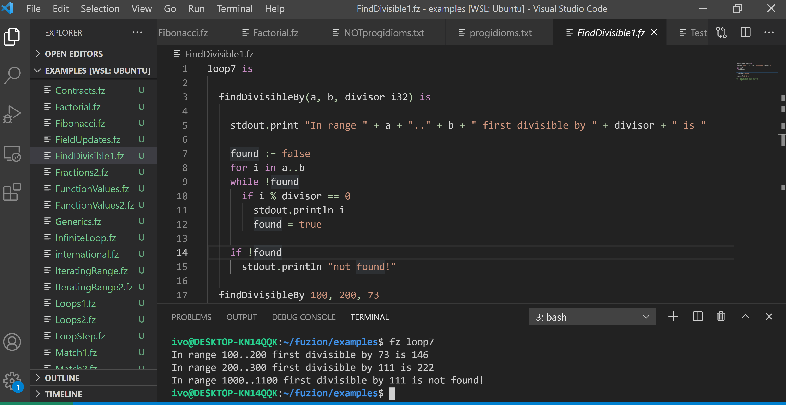

# vale-lang README

This is a Visual Studio Code extension to support development in the [Fuzion Programming Language](https://flang.dev).

To start using the extension, download, unzip and copy it into your <user home>/.vscode/extensions folder and restart VS Code.

## Features

Syntax Highlighting for `.fz` files

