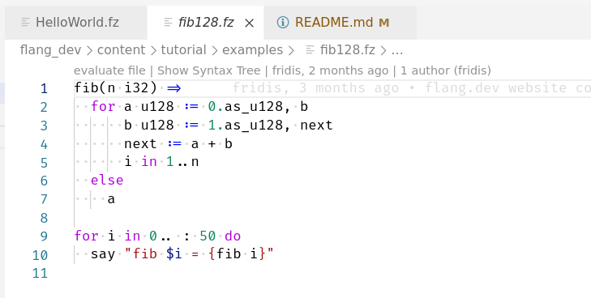
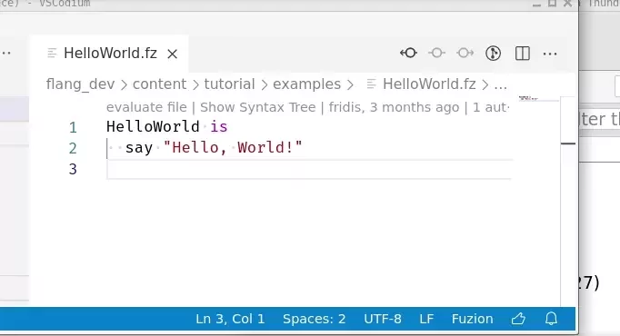
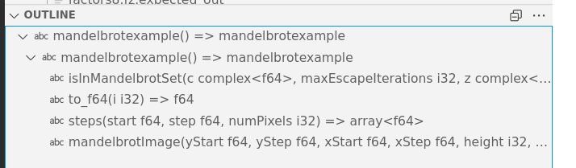
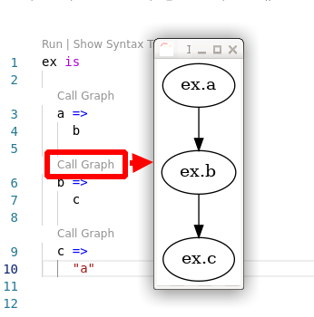

#  Fuzion extension for Visual Studio Code

This is a Visual Studio Code extension to support development in the [Fuzion Programming Language](https://flang.dev).

## Install (Java 17 required)
- https://marketplace.visualstudio.com/items?itemName=tokiwa-software.fuzion-lang
- https://open-vsx.org/extension/tokiwa-software/fuzion-lang

## Requirements
- `make`, `node`, `npm`, `javac`
- install example: `sudo apt-get install make openjdk-17-jdk nodejs npm`

### Windows (additional requirements)
- install wsl (Windows Subsytem for Linux)
- in wsl: `sudo apt-get install openjdk-17-jdk nodejs npm`
- set vscode-setting: "terminal.integrated.defaultProfile.windows": "Ubuntu-20.04 (WSL)"
- NOTE: the following is only neeeded when debugging on windows
- OR when you want to run `make run_tests` with 'windows-style' paths.
1) install https://www.msys2.org/
2) in msys2_shell install make: `pacman -S make`
3) install OpenJDK 17 or higher for Windows.

## Develop
- `git submodule update --init --recursive`
- `npm i`
- start debugging in vscode
- (optional) attach to java debugger at port 8000

## Build
- `npm run vscode:package`

## Tests
- `make run_tests`
- NOTE: this should work in both wsl and msys2_shell.

## Settings
- fuzion.java.modules
  - list of java modules the fuzion language server should use
  - example: ["java.base"]

## Features

- Syntax Highlighting for `.fz` files
- Language Server Client

### Syntax Highlighting

### Definition

### Completion

### Hover

### References

### Diagnostics

### Renaming

### Evaluation

### Syntax Tree

### Outline

### Signature Help

### Call Graph

## Known Windows (wsl) problems/workaround

---
Problem: tar EPERM: operation not permitted, futime

Workaround: `sudo umount /mnt/c && sudo mount -t drvfs C: /mnt/c -o metadata,uid=1000,gid=1000,umask=22,fmask=111`

---