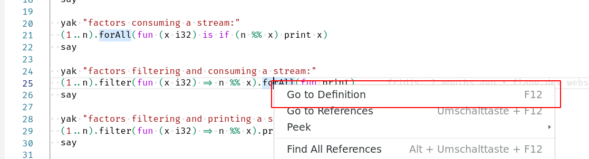
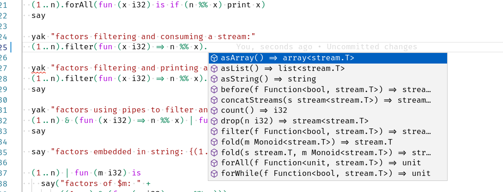
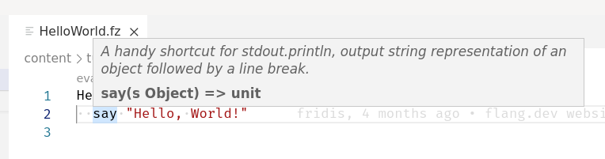
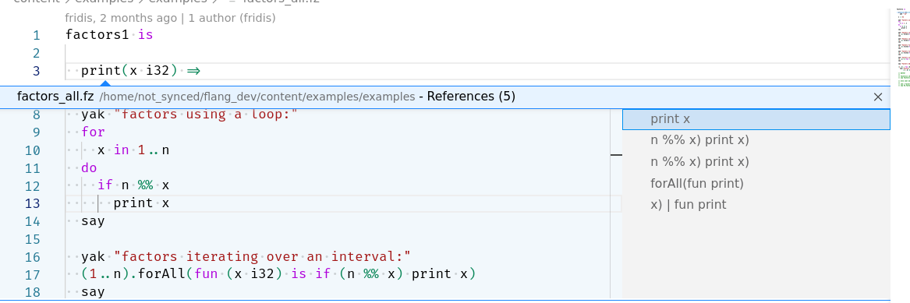
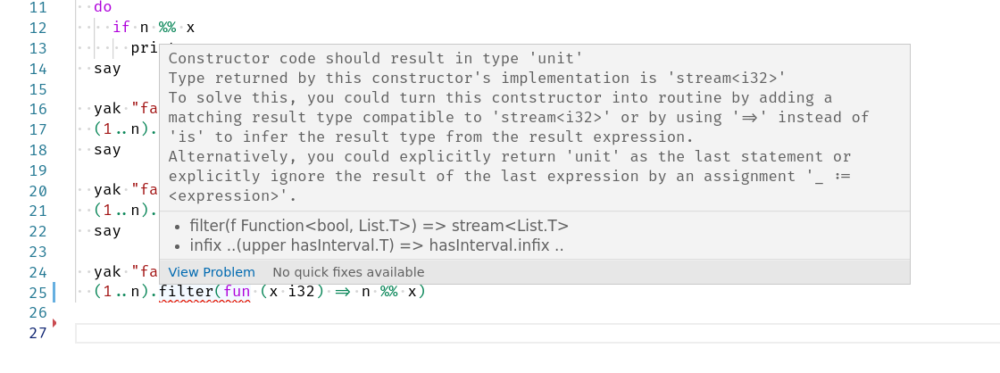
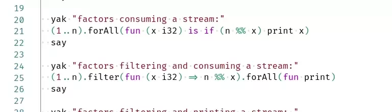

# vscode-fuzion README

This is a Visual Studio Code extension to support development in the [Fuzion Programming Language](https://flang.dev).

To start using the extension, download, unzip and copy the vscode-fuzion-n.m.o folder into your <user home>/.vscode/extensions folder and restart VS Code.

## Features

- Syntax Highlighting for `.fz` files
- Language Server Client

### Syntax Highlighting

### Definition

### Completion

### Hover

### References

### Diagnostics

### Renaming

## Develop
- Prerequisites: make, node, npm, javac
- git submodule update --init --recursive
- start debugging in vscode
- (optional) attach to java debugger at port 8000

## Build
- Prerequisites: make, node, npm, javac
- npm run vscode:package
